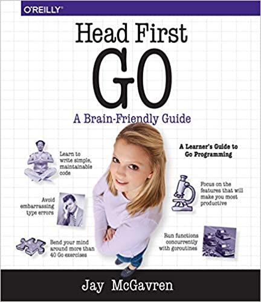

# Thoughts and Resources Learning Golang:

## Resources:

### Docs

[A Tour of Go](https://go.dev/tour/welcome/1)

[How to Write Go Code](https://go.dev/doc/code)

[Go by example](https://gobyexample.com)

[Effective Go](https://go.dev/doc/effective_go)

### Books

### Articles

[Write Go like a Pro](https://medium.com/gitconnected/write-go-like-a-senior-engineer-eee7f03a1883)